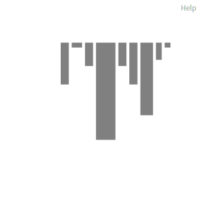

# Rapport

## Partie 0 : Création du projet TypeScript avec l’IA
Pour cette partie, nous avons utilisé Claude afin de vibecoder le projet. Le prompt, disponible en Annexe, a été rédigé à partir de l'énoncé de TP en reprenant les éléments importants relatifs aux fonctionnalités et contraintes attendus. Dans un premier temps, nous avions généré un projet ne contenant qu'une seule classe, mais cela ne présentait pas d'intérêt pour la visualisation Roassal (pas de comparaisons entre classes possible), c'est pour cela que nous avons choisi de reprendre notre prompt en ajoutant la phrase suivante : 

> *Il faut que le projet utilise un design orienté objet avec l’implication de plusieurs classes différentes.*

Cela nous a permis d'obtenir un projet disposant d'un design fortement orienté objet avec de multiples classes. Ce choix a également été réalisé en prévision du TP2, nous aurions dans tous les cas dû regénérer un projet avec plusieurs classes sur les recommandations du professeur.

Ce processus de vibecoding nous a pris au total 30 minutes (20 minutes pour la première génération et 10 minutes pour la seconde génération).

1. Oui, dans le cadre d'un cours. Le projet était de réaliser une application android en vibecoding. Cette première expérience était concluante malgré beaucoup de difficultés : le projet demandait d'avoir plusieurs classes communiquant entre elles et c'était un vrai challenge de débugger lorsqu'il y avait des problèmes. Pour ce projet, Claude, DeepSeek ainsi que ChatGPT ont été utilisés.

2. Pour ce projet TypeScript, l'utilisation de l'IA a été très simple. Claude a pu nous donner une solution satisfaisante répondant aux critères de fonctionnalités en seulement un prompt (cf. Annexe). Un point positif est la création spontanée par Claude d'un fichier README expliquant clairement comment utiliser le logiciel généré. Aucune difficulté n'est à signaler pour la réalisation de ce projet en vibecoding. Un deuxième prompt a néanmoins utilisé pour obtenir une solution utilisant plusieurs classes.

3. Ce projet (première génération) a pris 20 minutes : rédaction du prompt, création à la main des différents fichiers avec le code fourni par Claude à copier-coller, tests rapides avec les commandes fournies par le README, puis exécution des tests automatisés générés par Claude. Cela respecte largement le temps suggéré.

## Partie 1: Modélisation du projet TypeScript

Nous avons pu, avec l'aide du professeur, utiliser la commande `npm update -g ts2famix` afin de générer notre modèle json pour qu'il puisse être compatible avec la visualisation Roassal dans Moose.

1. Le modèle généré par ts2famix permet, à partir du code source, de représenter la structure du code. Ce modèle permet donc d'avoir une idée claire de ce qui se passe dans le code source.

2. Modèle de classes TypeScript en UML : Visualisation des différentes classes du projet et de leurs interactions. Permet de comprendre rapidement la structure d'un projet sans rentrer dans les détails de la structure du code source. 
Modèle ts2famix : Permet de visualiser plus en détail ce qui se passe au sein même des classes (accès aux attributs, appel aux méthodes...)

## Partie 2 : Visualisation du projet TypeScript

Cette section analyse la visualisation générée par Roassal, où chaque classe est représentée par un rectangle dont les dimensions et la couleur sont déterminées par les métriques suivantes :
* **Hauteur** : Nombre de méthodes (NOM).
* **Largeur** : Nombre d'attributs (NOA).
* **Couleur** : Nombre de lignes de code (LOC), allant du gris (faible) au rouge (élevé).

### 1. Quelles sont les classes remarquables dans le projet ? Comment le voyez-vous dans la visualisation ?

Trois classes se détachent nettement du lot par leurs caractéristiques géométriques et chromatiques :

* **Note :** C'est visuellement le plus grand rectangle de la visualisation. Elle combine une grande hauteur (18 méthodes) et la plus grande largeur (6 attributs). Sa couleur tire vers le rouge, indiquant un volume de code conséquent (110 LOC).
* **CLIController :** Ce rectangle se distingue par sa couleur rouge vif, signalant le maximum de lignes de code (135 LOC). Cependant, sa forme est particulière : elle est de hauteur moyenne (9 méthodes) mais très **étroite** (seulement 1 attribut).
* **NoteService :** C'est un rectangle haut (14 méthodes) et modérément large (3 attributs), également coloré en rouge (120 LOC), ce qui la place visuellement juste après la classe `Note` en termes de surface.

### 2. Expliquez le rôle de ces classes dans le projet. Pourquoi sont-elles importantes ?

* **Note (Entité du Domaine) :** Elle représente la structure de données centrale du projet. Sa "largeur" (attributs) définit l'état du système. Elle est importante car elle est utilisée par toutes les autres classes, créant un fort couplage de données.
* **CLIController (Interface Utilisateur) :** Elle gère les interactions avec l'utilisateur. Sa couleur rouge intense indique qu'elle contient la majorité de la complexité impérative (boucles, conditions) nécessaire pour traiter les entrées et afficher les menus.
* **NoteService (Logique Métier) :** Elle agit comme chef d'orchestre. Sa "hauteur" (nombreuses méthodes) montre qu'elle offre une API riche pour manipuler les notes (CRUD), isolant ainsi la logique métier de l'interface.

### 3. Commentez sur la qualité de la conception du projet. Y a-t-il des classes qui semblent mal conçues ? Pourquoi ?

L'analyse combinée des dimensions et de la couleur permet de diagnostiquer la qualité du code:

* **Problème de Cohésion dans `CLIController` :** Le contraste entre sa finesse (1 attribut) et son intensité rouge (135 LOC) est un indicateur d'alerte. Elle possède beaucoup de code pour peu de méthodes. Cela suggère des méthodes très longues et complexes.
* **Complexité de `Note` :** Le fait que `Note` soit à la fois très haute et très large indique qu'elle n'est pas une simple structure de données. Elle contient beaucoup de logique (18 méthodes). Idéalement, une entité devrait rester simple.
* **Bonne conception (`Tag`, `NoteFactory`) :** Ces classes apparaissent comme de petits rectangles gris (faible hauteur, faible largeur, couleur neutre). Cela indique une faible complexité cyclomatique et un bon respect du principe de Responsabilité Unique.

## Partie 3 : Exportation des données

Cette section détaille la démarche technique entreprise pour extraire les métriques du modèle FamixTypeScript vers un format externe, ainsi que la procédure de sauvegarde du code source. L'ensemble des scripts Smalltalk et des configurations techniques de cette partie a été réalisé avec l'assistance de l'IA **Gemini**.

### 1. Développement de l'exportateur dans Moose
Afin d'extraire les données du modèle pour une utilisation externe (Partie 4), nous avons mis en place une infrastructure d'exportation au sein de l'image Moose :

* **Création de la structure :** Nous avons créé un package nommé `TP1-Export` contenant une classe `TSCSVExporter`.
* **Implémentation avec NeoCSV :** En utilisant la bibliothèque **NeoCSV**, nous avons développé une méthode permettant de parcourir le modèle `FamixTypeScript` chargé. Le script extrait spécifiquement les métriques correspondant à la visualisation Roassal pour garantir la cohérence de l'analyse :
    * Nom de la classe (`name`)
    * Nombre de méthodes (`numberOfMethods`)
    * Nombre d'attributs (`numberOfAttributes`)
    * Lignes de code (`numberOfLinesOfCode`)
* **Génération :** Le script génère un fichier nommé `export_donnees_tp1.csv` à la racine du répertoire de l'image Pharo.

### 2. Synchronisation Git via Iceberg
Conformément aux exigences de versionnage du TP, nous avons utilisé l'outil **Iceberg** pour synchroniser le travail sur un dépôt GitHub public :

* **Configuration SSH :** Pour sécuriser les échanges sans utiliser de jeton d'accès classique, nous avons configuré les *Credentials* d'Iceberg pour utiliser une paire de clés SSH (`id_ed25519`) générée localement sur le poste de travail.
* **Liaison et Push :** 1. Le dépôt distant a été ajouté via son URL SSH.
    2. Le package `TP1-Export` a été lié au dépôt local.
    3. Un **Commit** a été effectué pour sauvegarder les modifications, suivi d'un **Push** vers GitHub.

### 3. Livrables de la partie 3
* **Lien du dépôt Git :** https://github.com/TadjouSteve/TP1_MGL843_EXPORT_V2
* **Fichier exporté :** Le fichier `export_donnees_tp1.csv` est inclus dans le dépot Git contenant le code source.

## Partie 4 : Visualisation externe

Cette section présente l'analyse des données extraites du modèle Famix-TypeScript via notre classe Pharo. L'objectif est d'utiliser un outil tiers pour valider les tendances de conception observées sous Moose.

### 1. Méthodologie et outil utilisé
L'outil choisi pour cette visualisation est **Microsoft Excel**. 

**Procédure de traitement :**
1. **Importation :** Chargement du fichier `export_donnees_tp1.csv` avec le point-virgule comme délimiteur.
2. **Nettoyage :** Suppression des guillemets et conversion des colonnes `Nb_Methodes`, `Nb_Attributs` et `Lignes_de_Code` au format numérique.
3. **Graphique :** Génération d'un **histogramme groupé** pour comparer visuellement la taille (LOC) par rapport à la complexité structurelle (NOM).

### 2. Analyse des métriques
L'examen du graphique permet de dégager des conclusions sur la qualité de la conception du projet :

* **Densité de code et Cohésion (LOC vs NOM) :** 
    * La classe `CLIController` présente un déséquilibre marqué avec **135 LOC** pour seulement **9 méthodes**. Ce ratio élevé (environ 15 lignes par méthode) suggère une faible cohésion. Cela indique des méthodes trop complexes qui pourraient être décomposées pour respecter le principe de modularité.
    * À l'inverse, la classe `Note` possède le plus grand nombre de méthodes (**18 NOM**) pour **110 LOC**. Cela démontre une haute cohésion, avec des responsabilités atomiques et bien réparties.

* **Respect du Principe de Responsabilité Unique (SRP) :**
    * Les classes `NoteFactory` et `App` affichent des métriques minimales. Ce profil bas est caractéristique de classes utilitaires ou de coordination qui respectent le **SRP**, facilitant ainsi les tests unitaires et la maintenance.

### 3. Conclusion sur la maintenance
La visualisation confirme que le "poids" du système est concentré dans le service et le contrôleur. Pour optimiser la maintenance future, un refactoring du `CLIController` serait recommandé afin de déléguer davantage de logique vers des classes spécialisées, réduisant ainsi la complexité cyclomatique globale.

 
 
 

# Annexe

### Annexe 1. Dépôt Github du projet Typescript
https://github.com/NahelMzg/TP1-NoteManager

### Annexe 2. Dépôt Github du projet Moose
https://github.com/TadjouSteve/TP1_MGL843_EXPORT_V2

### Annexe 3. Prompt utilisé pour généré le projet TypeScript -

Tu es un codeur expérimenté et tu dois réaliser un petit logiciel simple de création de  notes en Typescript dont les spécifications te sont données ci-après. A partir de ces spécifications, prends les initiatives nécessaires pour réaliser ce logiciel, avec ou sans interface utilisateur, selon ce que tu penses être la meilleure solution. Il faut que le projet utilise un design orienté objet avec l’implication de plusieurs classes différentes.

Voici les fonctionnalités minimales du logiciel :
— Créer des notes
— Afficher (lister) des notes
— Associer des étiquettes (tags)
— Rechercher des notes
— Sauvegarder (exporter) les notes localement

Voici les spécifications du logiciel :
— Langage : TypeScript
— Environnement : Node.js
— Persistance locale (ex. fichier JSON, SQLite, etc.)
— Interface : CLI ou API REST simple
— Tests automatisés : tests de fonctionnalité avec Jest

Voici les contraintes sur les tests :
— Utiliser le framework de test Jest pour écrire les tests.
— Les tests doivent être des tests de fonctionnalité (end-to-end ou intégration légère).
— Aucun test unitaire n’est requis ni attendu.
— Cette contrainte est intentionnelle : en l’absence d’une conception modulaire explicite, l’écriture de
tests unitaires serait artificielle et peu représentative de la réalité du code généré.
— Les tests doivent couvrir les fonctionnalités minimales listées ci-dessus.
— Les tests doivent être exécutables via une commande npm (ex. npm test), idéalement dans une
action GitHub lors de chaque commit.

